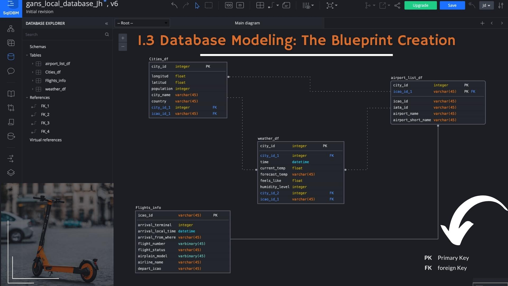
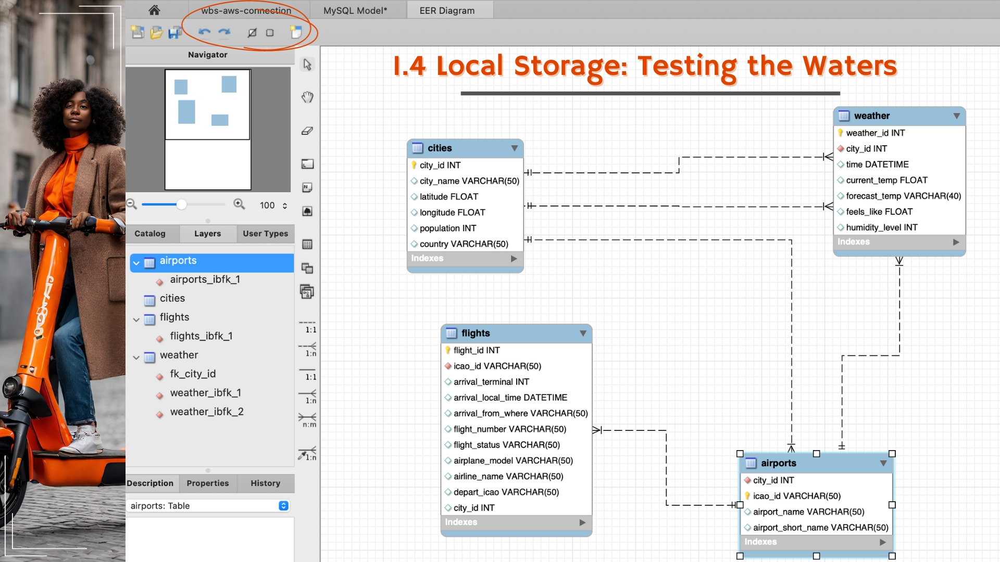
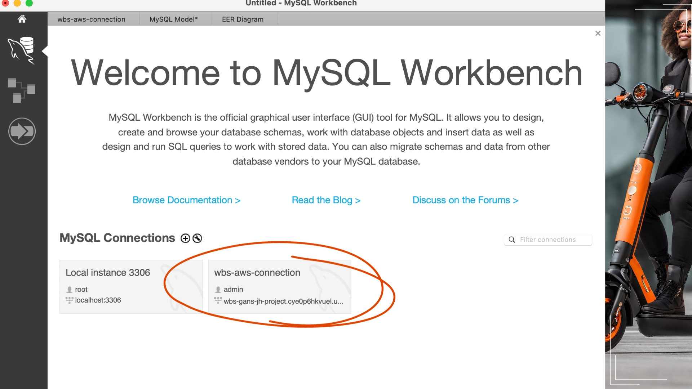
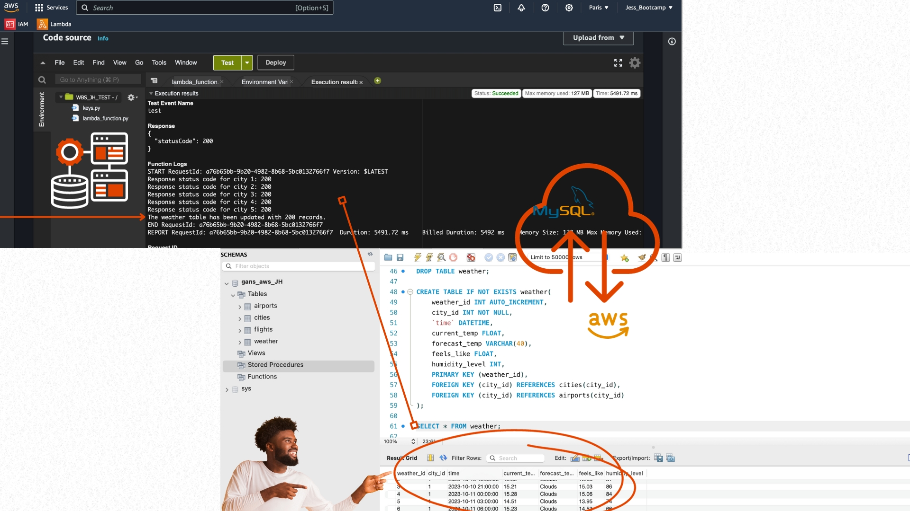
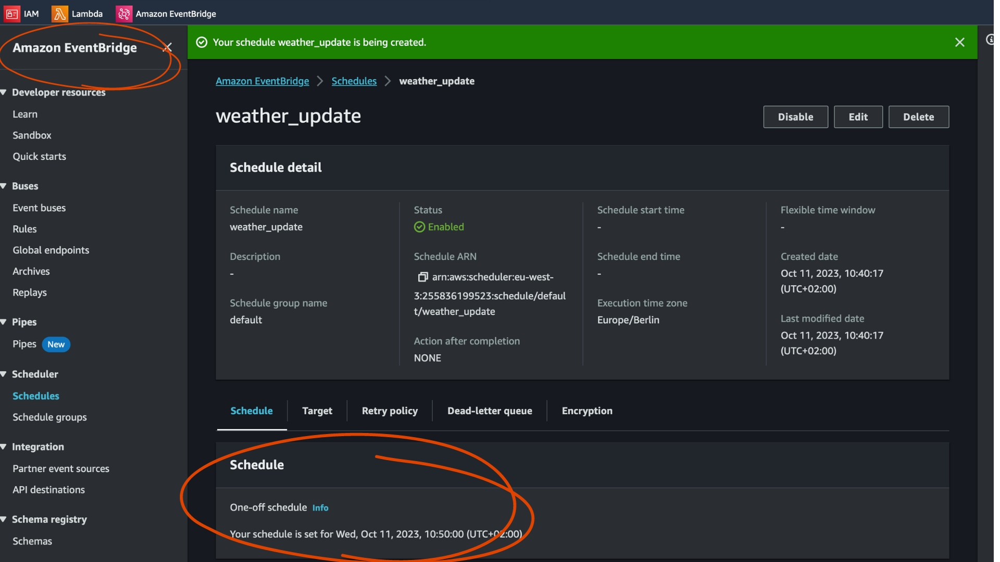

# Behind the Scenes: Data Pipelines and Cloud Innovation 

# Table of Contents

🛴 **E-Scooter GANS - 📌Case Study, Data Engineer Role** 
  - Context and Challenges
  - Problem Statement
  - Potential Solutions Beyond Predictive Modelling

🛠 **Setting Up the Data Pipeline**

- **Phase 1: Local Pipeline**
    - Web Scraping: The Treasure Hunt
    - APIs: The Love Language of the Internet
    - Database Modeling: The Blueprint Creation
    - Local Storage: Testing the Waters
  
🌥 **Transition to Cloud**

- **Phase 2: Cloud Pipeline**
    - Cloud Database Connected to MySQL
    - Lambda: The Cloud's Command Center
    - Automation: The Digital Clockwork

⚠️ **Disclaimer**
  - Project Scope and Limitations

💡 **In a Nutshell**
  - Key Takeaways and Processes

🤔 **Reflections**
  - The Depth and Complexity of Data Engineering
  - The Five Pillars of a Data Analyst

📝 **Conclusion**
  - Final Thoughts on the Project and its Impact
 
----

## E-Scooter GANS - 📌Case Study, Data Engineer Role

✓ **Context**: Imagine that I have been "hired" by Gans, an e-scooter startup aspiring to operate in 5 of the major cities of Germany. The challenge faced by such companies isn't just sustainability but also ensuring scooters are available where users need them.

✓ **Problem**: Scooter movement isn't always symmetrical. While the eco-friendly narrative is a significant selling point, Gans identified a more pressing operational challenge: **ensuring scooters are conveniently available for users**. Setting up a coffee shop ☕️ is similar: it's not just about brewing the best coffee but also about being where coffee lovers are. In an ideal world, for every user that takes a scooter **from point A to B**, another user would bring it back. However, real-world scenarios present different challenges:

- 🌍 In cities with hills, riders prefer scooters for uphill journeys and choose to walk downhill.
- 🚘 The Daily Commute: Mornings see a rush from residential areas to city centers.
- 🌦️ Weather: A sudden downpour can drastically reduce e-scooter usage.
- 💃🏽 Tourist Patterns: Tourists, especially the younger demographic, prefer scooters available near landmarks or downtown.

✓ **Solving the Puzzle: Beyond Predictive Modelling**

While predictive modeling is the end goal 🏃🏽‍♀️, the first step involves data collection, transformation, and storage. The immediate solution includes:

1. Physical Rearrangement: Deploying trucks to move scooters to high-demand areas.
2. Economic Incentives: Encouraging users to pick or drop scooters at specific locations through financial perks.

⚠️ **However**, to implement these strategies effectively, a critical ingredient is needed: **data, data, data**.

**So, my role consists of**: Collecting data from external sources to help Gans predict e-scooter movement, and assembling and automating a data pipeline in the cloud. This involves:

1. **Data Collection:** Using tools like web scraping and APIs to gather data.
2. **Data Cleaning:** Ensuring the data is relevant and error-free.
3. **Data Storage:** Organizing the data in a manner that's easily accessible and usable.
4. **Data Automation:** A cloud database with real-time updates.
5. **Data Ready For:** The data analyst department to work with!

## The Process: Breaking Down the Data Pipeline

Creating a data pipeline is like setting up a sophisticated railway system. Trains (data) must run smoothly, arrive on time, and ensure passengers (users) are satisfied. 

Here's a step-by-step breakdown:

### Phase 1: The Local Pipeline

Imagine you're assembling a toy train set in your living room. Before setting it out in the vast outdoors, you'd first test it in a controlled environment to ensure everything works smoothly. Similarly, before deploying a data pipeline in the expansive digital cloud, it's prudent to first set it up locally on your computer.

#### 1.1 Web Scraping: The Treasure Hunt

Just as treasure hunters used old maps and delved into unknown terrains, modern data engineers navigate the vast expanse of the internet (if the information is legally disclosed). With **Python's BeautifulSoup library**, valuable data hidden within website codes is extracted. It's like uncovering hidden gems embedded in the digital landscape. Some of the data I will need will be found on the internet, as the content of websites. This information is acquired by downloading and **extracting the HTML code from these sites**.

#### 1.2 APIs: Or as I call them, the love language of the internet

Imagine knocking on the doors of various data houses and politely asking for information. APIs serve as these doorbells, allowing seamless interaction and data exchange. With **Python's requests library**, interacting with these APIs becomes as easy as ringing a doorbell and acquiring the specific data I need. Assembling a request with the right parameters is key! Each API might have its own language, or even better, some of them might already use the programming language that a data engineer employs daily. 

For this project, I used the following APIs to collect data that will enable GANS to solve the puzzle:

- 🌍 **Cities table:** I began by web scraping Wikipedia for information such as Latitude and Longitude, as well as population density. However,
  Wikipedia's reliability can be inconsistent. Thus, I decided to use an API from
  🔗 https://api.api-ninjas.com/v1/city for this table.
  Check out how did I code this collection on : `cities_df_tosql.ipynb` on the files on this repository 🗂️
  
- ☀️ **Weather table:** To gather up-to-date information on the weather conditions in the cities I am researching,
  I used 🔗 https://openweathermap.org.
  Weather collection code: `Weather_data_tomySQL.ipynb` on the files on this repository 🗂️
  
- 🛬 **Airports & Arrival flights table:** As part of GANS's strategy to have e-scooters available for tourists in these cities.
  I collected the main airport ICAO IDs relevant to the cities of analysis. This will assist me in searching for real-time arrival flight information;
  I used 🔗 https://aerodatabox.com.
  Airports & Arrival table collection code can be seem here: 🗂️`airports_arrival_tomySQL.ipynb` and `Flights_to_mysql-2.ipynb` on the files on this
  repository 🗂️

#### 1.3 Database Modeling: The Blueprint Creation

Before constructing a building, architects draft a blueprint. Similarly, before storing data, a logical structure or model for the database is essential. This involves determining the tables, their relationships, and the best way to organize data. This foundational step ensures that data is stored efficiently and can be accessed swiftly by Data Analysts. While data stored as dictionaries or **Pandas DataFrames** in Python objects are great for local exploration and analysis, ⚠️ they are not the optimal format for quick data availability. 

Here is where **Relational databases** come in. Determining the logical structure of the database is a crucial first step when a company decides to start storing data. Which tables will be needed? How will these tables be related to each other? What 'datatypes' will the information require? Only after answering these questions (and more) is it time to start creating. I knew I wanted to test and deploy my tables first locally, and for this step, my preferred tool is MySQL. Before creating anything, I used 🔗 https://app.sqldbm.com/MySQL to visualize these relationships.

#### 1.4 Local Storage: Testing the Waters

Once the blueprint is ready, it's time to test the waters. By setting up a **MySQL instance locally**, I can ensure that the data from the APIs and web
scraping is stored correctly. It's akin to test-driving a car before hitting the main road. Once I have created the **database model**, I test the
connection **between Python and MySQL** by setting up the database locally on my computer and storing the data I collected from the APIs.

### Phase 2: Cloud Pipeline

Now, imagine wanting to share a toy train set with the world. You'd move it from your living room to a park, where everyone can see and appreciate it. Similarly

Once the local pipeline is set up, it's time to transition it to the cloud, making it both accessible and scalable. If you use Google Drive or Apple’s iCloud, your files are stored in the cloud. **The cloud is a catch-all name for any technological resources or services accessed via the internet**. And it offers numerous advantages when building data pipelines: scalability, flexibility, automation, and maintenance. Gone are the old days (I'm not saying they're extinct) when rooms full of computers and cables required significant initial investments and ongoing maintenance. Now, I've chosen the cloud.

#### 2.1. Cloud Database connected to MySQL

By using **RDS from Amazon Web Services (AWS)**, the world's leading public cloud provider, one can set up a **MySQL database in the cloud**. It's akin to moving your treasured book collection from a local shelf to a grand library where many can access it.

#### 2.2 Lambda: The Cloud's Command Center 🫡

Transitioning scripts to Lambda is like moving from using personal diaries to collaborative online platforms. **AWS Lambda** allows code to run seamlessly in the cloud, ensuring data collection occurs and is transferred to the created database. I shifted my data collection scripts from **Jupyter Notebook** to AWS Lambda functions by copying and pasting my local database script in a structured manner. The funtions I created can be found on this repository files 🗂️ `Flghts_AWS_Lambda_function.py` and 🗂️ `Weather_AWS_Lambda_function.py`

#### 2.3 Automation: The Digital Clockwork

This is where the magic ⚡️ happens. One of the cloud's biggest perks is automation. Using **AWS's CloudWatch Events or EventBridge**, one can set rules, much like setting alarms on a clock. When the conditions are met, the data collection scripts are triggered, ensuring timely, relevant, and efficient data gathering.

> **⚠️ Once completed**
> The pipeline should resemble the flowchart below, and everything should be ready for the Data Analysis department to take over 🤸🏽

#### Disclaimer ❗️

Data pipelines can get more complex than this. So, I want to ensure we set the right expectations:
• I will not connect our data pipeline to a BI tool.
• I will not be creating either a data warehouse or a data lake.
• I will not work with big data, data streaming, or parallel computing.
This project is a beginner's start with a simple approach before moving on to more advanced (and often more complicated) solutions.

## In a nutshell 💁🏽‍♀️

From the outside, it might seem simple—I was just moving data from one place to another. But if you (the reader) have found it challenging to follow the entire process, you might now understand how complex data pipelines can become. To summarize:

- Collected data from the internet by writing a web scraping script using **Python’s library BeautifulSoup**.
- Collected **data from the internet through APIs**, either using a **Python wrapper such as spotipy or pyowm**, or assembling the call directly with the **requests library**.
- Navigated **JSON files** to find the information I needed.
- Cleaned data using **Python’s string operations, str methods from the Pandas library, or regex**.
- Wrote **for loops and list comprehensions** in Python to perform tasks iteratively.
- Structured **Python code as functions**.
- Set up a **local MySQL database**.
- Created an **SQL data model**, determining the relationships between tables.
- Created MySQL tables with the **appropriate data types, constraints, and keys**.
- Set up an **RDS instance** on AWS and enabled the connection between my computer and the cloud instance, both through a standard client such as MySQL Workbench and through Python, using **MySQL-python-connector**. 🔌
- **Populated the MySQL tables** with collected data through INSERT queries executed from a Python script.
- Set up **Lambda functions** to run my code in the cloud (using a serverless service).
- Created **custom Layers** with ad-hoc dependencies for the Lambda functions.
- Scheduled the Lambda functions **to run on a specified schedule**.

## But, you might wonder, Is that all?

The answer is yes! A data engineer's work is, in my opinion, the backbone of data analysis. This project involved moving data pipelines from local environments to the cloud. Think of it as an astronomer extending their study from Earth to the vastness of space. My scripts, initially run on local machines, have now found a new home in AWS Lambda, ensuring relevant and up-to-date data collection. While developing this project, I realized that I had applied **The Five Pillars of a Data Analyst** too, which played a pivotal role:

- **1▸ Curiosity:** The quest to understand e-scooter movements, much like a scientist's thirst for answers, drove this project.
- **2▸ Understanding the Context:** Analyzing data without context is like reading a book in an unknown language. Recognizing patterns in scooter
  movements required a deep understanding of the urban landscape.
- **3▸ Technical Mindset:** Breaking down the challenge into smaller, manageable tasks was crucial. It's the art of seeing the bigger picture and
  understanding the minute brushstrokes that create it.
- **4▸ Data Design:** Imagine a librarian arranging books, ensuring that readers find what they're looking for without hassles.
- **5▸ Data Strategy:** Managing the tools, processes, and the team's inputs needed, much like conducting an orchestra, ensuring each instrument plays
  its part.

## 🙇🏽‍♀️The outcome?
Gans "now has" a powerful data-driven tool to understand scooter movements and ensure availability where users need them. Like every journey, this one had its share of challenges and triumphs. But the joy of reaching the destination 🛫, of seeing data flow seamlessly, made every hurdle worth it.

**So, the next time you hop onto an e-scooter, remember, there's a world of data working behind the scenes, ensuring your ride is smooth!** 🛴📈🚀

**Written by Jessica Hernandez**
🤓 Soon to be Data Scientist
